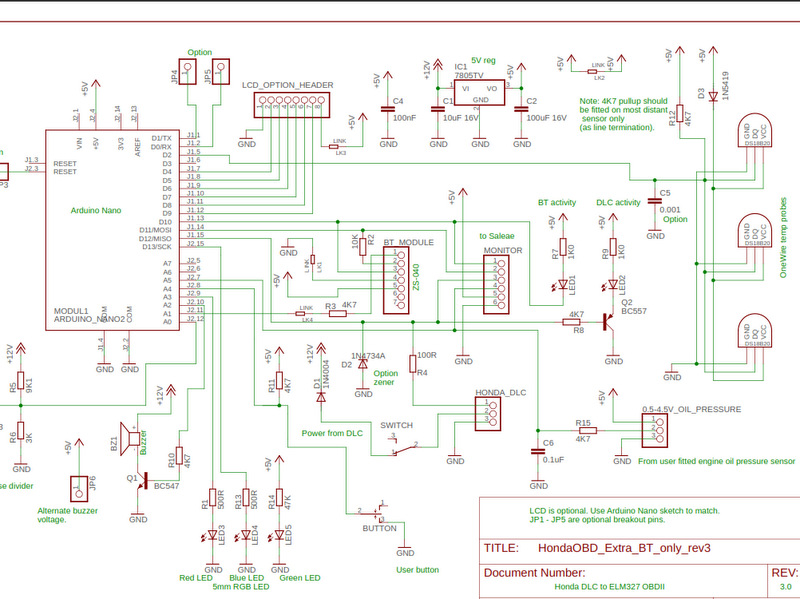
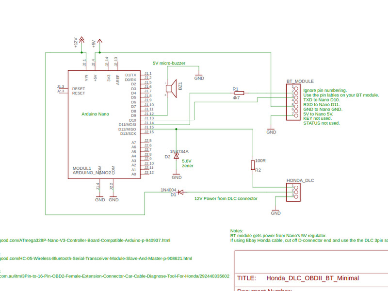

Arduino Honda OBD to OBDII via BlueTooth (based on ArduinoHondaOBD original project by kerpz)
===========
An arduino project that reads old Honda OBD diagnostic protocol and translates it to ELM327 protocol, so any Android OBDII scanner apps can connect with the older Honda OBDI ECU's, and read sensor data like it was actually an OBDII ECU (for countries where Honda did NOT have to use OBDII protocol).
The project connects the older generation Honda ECU's to an Android or Windows app via bluetooth serial. All the regualar available EFI sensors are translated. Typically you would use this with apps like 'Torque' (which normally use an ELM327 or compatible bluetooth dongle). 

This fork now has two versions building on kerps original project and his code.
 
Compact version - A very low component count version that uses only two resistors and two diodes with the Arduino Nano and a HC-05 bluetooth module. A buzzer is optional.

Expanded version - This is my personal development version that has been here a couple of years. It adds extra sensors to the car and engine, that are connected to the Arduino Nano via cables. The sensors are three Dallas DS18B20 1-wire sensors, and a voltage output type oil pressure sensor. The dallas temperature sensors are intended to be glued down with a high temperature heatsinking adhesive to the engine sump case, gearbox case and differential case (using adhesive bought from Ebay for mounting high power LED's to heatsinks etc). If a good place is chosen on these cases where there are minimal fins and below the oil fill line, the temperature is fairly close to what's inside.

Supports
--------
* Honda ECU's before 2002 in countries other than the USA (who had OBDII after 1996).
* This fork will be tested on an OzDM 1999 Honda S2000 used for track days. It should work on other 90's Hondas but will depend on what * ECU it's got. Try the compact version if there are doubts...

Files
-----
* hobd_elm_with_DS18B20 - My current main version (with no LCD) and three extra temperature sensors, oil pressure sensor, buzzer and RGB * warning LED.
* honda_dlc_to_obdii_bluetooth - Compact version with minimul component count. 
* 

Basic Arduino wiring applicable for both versions
-------------------------------------------------
    Honda 3 Pin DLC           Arduino Nano
    Gnd --------------------- Gnd
    +12 --------------------- Vin
    K-line ------------------ Pin12

    HC-05 Bluetooth           Arduino Nano               
    Rx ---------------------- Pin11
    Tx ---------------------- Pin10

Wiring image for EXPANDED VERSION - hobd_obd_bt_extra_sensors.ino
---------------------------------------------------------
    *See the schematic PDF in the schematic folder for my full circuit.
    My circuit follows Kerpz original as much as possible for compatibility.
    I have 'industrialised' the circuit a little to make it robust in an automotive environment.
    Kerpz's wiring diagram can be used with my code additions by adding the DS18B20's. 
    The extra complexity of my cicuits includes provision for the PCB to be used with an LCD,
    and access to key pins for monitoring with a CRO or Logic analyser. 
    Debugging serial terminal work in the Arduino IDE from the USB port.
    
 *Got to 'schematics' folder and the PDF versions for full detail.

Wiring image for COMPACT VERSION - honda_dlc_to_odbii_bluetooth
------------------------------------------------------------------
*See the compact_schematic PDF in the schematic folder for full detail.
 

Notes
------------------------------------------------------------------
Hopefully there is enough info available here to make this project.
What's not apparent is the HC-05 bluetooth module needs to be programmed via TTL inteface
to match the bt_serial baud rate selected in the INO setup. 
Default module speeds are sometimes 9600 baud but can be 38400 baud also. One of my 
BT modules only works properly up to 19200baud, so my INO may be set to that rate.
Change as required...

Lastest efforts..
------------------------------------------------------------------
Added a few new Honda OBD sensors as I found ones that worked (for me on my car at least). Still confirming some others as drive time permits.

######Now have additionally:

Intake Air Control Valve %

Knock sensor

Second O2 sensor voltage (post cat - S2000)

Injector Duration in mS

Closed Loop indicator (flag bit)

A/C Clutch (flag bit)

**Previously had:
*RPM
Speed
Timing
O2 sensor volatge (Pre Cat)
Coolant temp
Intake Air temp
Flag bits:
  A/C Relay 
  O2 Heater 
  VTEC Solenoid 
  VTEC Enabled
  EFI Relay
  Brake Switch
 
 **Extended by my added senors:
  *Oil Temp
  Transmission temp
  Differential temp
  (testing oil pressure next)  
  

TODO
-----
* Upload Eagle files
* Code tidy-up ongoing ;)
* 
